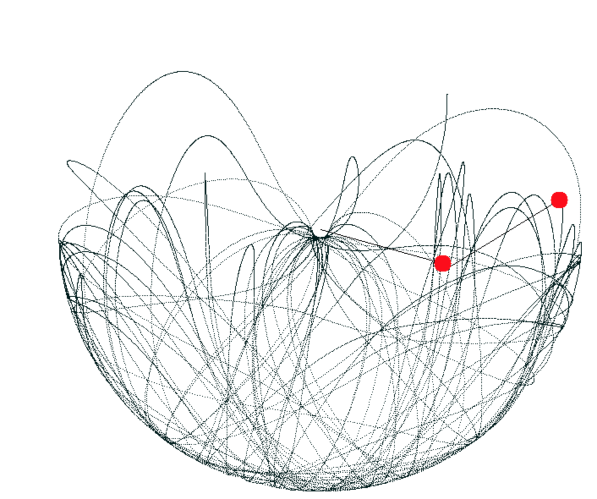

# Double Pendulum simulation/Visualization in C

## Requirments
SDL2 must be downloaded

## Summary
Using C and SDL I simulate and visualize a double pendulum.

## Functions:

### draw_circle()
Draws a filled circle on a pendulum.
Takes a pointer to a SDL_Renderer (renderer),
int32_t x cordinate (cx),
int32_t y cordinate (cy),
the two cordinates should represent the start of the circle. Return type of void.

### update_state()
Updates the position and acceleration of the pendulums.
All this information is stored inside the State struct.
takes a pointer to a State object. Return type of void.

### draw_path()
This is the function that shows all the previous paths of the pendulum
and gives the program the cool resulting pattern of the pendulums path.
Takes a pointer to the renderer, the uint32_t canvas which is stored in the State objecy,
a pointer to the SDL_Texture and two doubles (x and y) which represent the current point of the second pendulum.
The canvas is a single dimensional array that stores the cordinates of the window which allows us to efficiently draw
and render the traces of the pendulum each time the screen is cleared. Return type of void.

### void draw_pen()
Draws one of the pendulumns to the window.
Takes a pointer to a State, a pointer to a SDL_Renderer, and a pointer to a SDL_Texture
Return type of void.

### create_state()
Pass in the params of the state basically cistomaizing the pendulumns angle, and length mass.
takes all doubles.
2 for the lengths (l1 and l2),
2 for the masses (m1 and m2),
two for the intitial angles (as anglesIi convert to radians) (a1, a2).
stores all the a's, l's,m's to arrays along with avs (angular velocity)
and a canvas which represents the dimensions of the window so that we can mark where the pendulum was
in order to create the cool tracing pattern of the pendulum.
return type of State.

### free_state()
Frees the memory allocated to the state.
takes in a pointer to the State object
return type of void

## PIC

## SOURCES
Math: https://oguz81.github.io/DoublePendulum/
